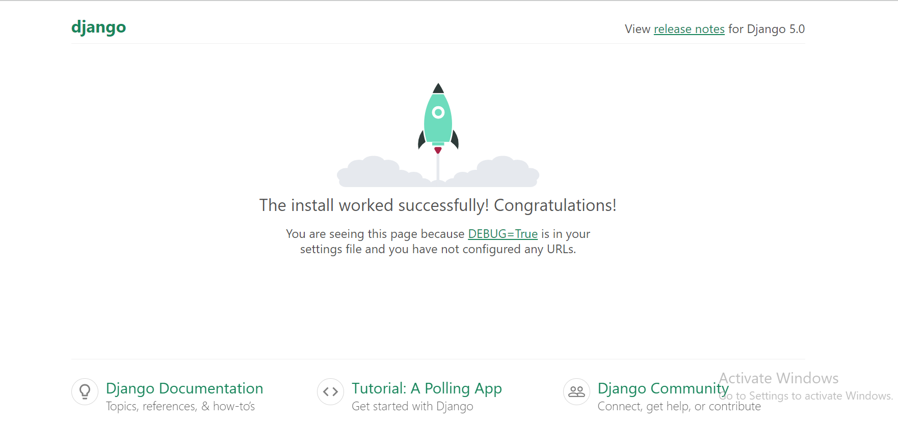

<H1 align="center"> Django Application</H1>

## Steps To Start a Django Application

**1. Install Django**
```
python -m pip install Django
```
[`Reference Link`](https://docs.djangoproject.com/en/5.0/topics/install/#installing-official-release)

**2. Verify Django Installation**
```
python -m django --version
```
If Django is installed, you should see the version of your installation. If it isn’t, you’ll get an error telling “No module named Django”.

**3. Creating a new project**
```
django-admin startproject myProject
```
This will create a mysite directory in your current directory.
Let’s look at what startproject created:
```
mysite/
    manage.py
    mysite/
        __init__.py
        settings.py
        urls.py
        asgi.py
        wsgi.py
```

**4. Run the server**

Run the command in the terminal to run our Django server.
```
python manage.py runserver
```
After running this if you go to "HTTP://localhost:8000" You will get the below-given page running in your localhost.


**5. Creating a new app**

To create your app, make sure you’re in the same directory as manage.py and type this command:
```
python manage.py startapp projectApp
```

**6. Add the new app to the project**

By adding app path in urls.py inside the project folder (myProject).
```
from django.contrib import admin
from django.urls import path, include
 
urlpatterns = [
    path('admin/', admin.site.urls),
    path('', include("projectApp.urls")),        # newly added line
]
```
Now You can use the default MVT model to create URLs, models, views, etc. in your app and they will be automatically included in your main project.

**7. Create urls.py in the App folder**

Include the following code in the urls.py for 
```
from django.urls import path

#now import the views.py file into this code
from . import views
urlpatterns=[
    path('', views.index, name='index'),
]
```

**8. Add the first index function for frontend in the views.py**

In Django, We will define all our frontend webpages as functions in views.py
The above code will call or invoke the function which is defined in the views.py file so that it can be seen properly in the Web browser. 
Add the following code in views.py of App directory:-
```
from django.http import HttpResponse

def index(request):
  return HttpResponse("Hello Geeks")
```
After adding the above code, go to the settings.py file which is in the project directory, and change the value of ROOT_URLCONF from ‘project.urls’ to ‘app.urls’
```
ROOT_URLCONF = 'mysite.urls'
```
And then you can run the server(127.0.0.1:8000) and you will get the desired output - "Hello Greeks".

**9. Create first index.html frontend**
- Create a Template Directory:
  
  Ensure you have a templates directory within your Django app directory. If you don't have one, create it.
  ```
  myapp/
    templates/
            index.html

  ```
- Add the Template Directory to Settings:
  
  In your Django project's settings.py, add the TEMPLATES directory if it's not already set up:
  Update the code as shown below
  ```
  TEMPLATES = [
    {
        'BACKEND': 'django.template.backends.django.DjangoTemplates',
        'DIRS': [BASE_DIR / 'templates'],  # Ensure the 'templates' directory is included
        'APP_DIRS': True,
        'OPTIONS': {
            'context_processors': [
                'django.template.context_processors.debug',
                'django.template.context_processors.request',
                'django.contrib.auth.context_processors.auth',
                'django.contrib.messages.context_processors.messages',
            ],
        },
    },
    ]
  ```
- Create the index.html File:
  
  Create an index.html file within the templates/ directory.
    ```
    <!-- myapp/templates/myapp/index.html -->
    <!DOCTYPE html>
    <html lang="en">
    <head>
        <meta charset="UTF-8">
        <meta name="viewport" content="width=device-width, initial-scale=1.0">
        <title>Index Page</title>
    </head>
    <body>
        <h1>Welcome to MyApp</h1>
    </body>
    </html>
    ```
- Create a View for the Index Page:
  
  In your app's views.py, create a view that will render the index.html template.
    ```
    from django.shortcuts import render
    
    def index(request):
        return render(request, 'index.html')
    ```


**8. Install DataBase**
[`Reference Link`](https://docs.djangoproject.com/en/5.0/topics/install/#database-installation)

**9. Database setup**
In settings.py update the database as Postgresql
```
DATABASES = {
    "default": {
        "ENGINE": "django.db.backends.postgresql",
        "NAME": "mydatabase",
        "USER": "mydatabaseuser",
        "PASSWORD": "mypassword",
        "HOST": "127.0.0.1",
        "PORT": "5432",
    }
}
```
